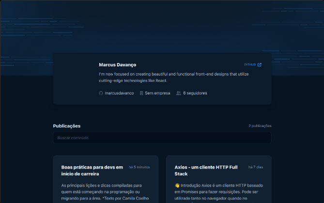

<h1 align="center"> GitHub Blog  </h1>

	This web application was built using ReactJS and TypeScript, the project itself was created using Vite, It was styled with StyledComponents and the for the logical part, React-Hook-Form and Zod Validation for the forms, alongside Axios for the API Requests. The state was managed using React's Context API. 

  

 

  <h3 align='center'>Web</h3>
  

## ✅ Status

- Finished ✅

## 👨🏼‍💻 Functions

- Display Issues 
- Search

## 🚀 Technologies

This project used the following technologies:

- React
- Typescript
- Styled Components 
- FontAwesome
- React-Hook-Form
- Axios
- Git e Github

## 💻 Project

This project was developed to solve the second challenge of Ignite's React track

- [Access the project finished, online](https://github-blog-pearl.vercel.app/)

## 🔖 Layout

- Access the project layout through [this link](https://www.figma.com/file/yGYjYHDcXBvxQShTIRu2Bo/GitHub-Blog-(Community)-(Copy)?type=design&node-id=0-1&t=V91duHqJbmqszgbP-0). A [Figma](https://figma.com) account is required.

## :memo: License

- Excluding the layout, this project is under the license GPL-3
